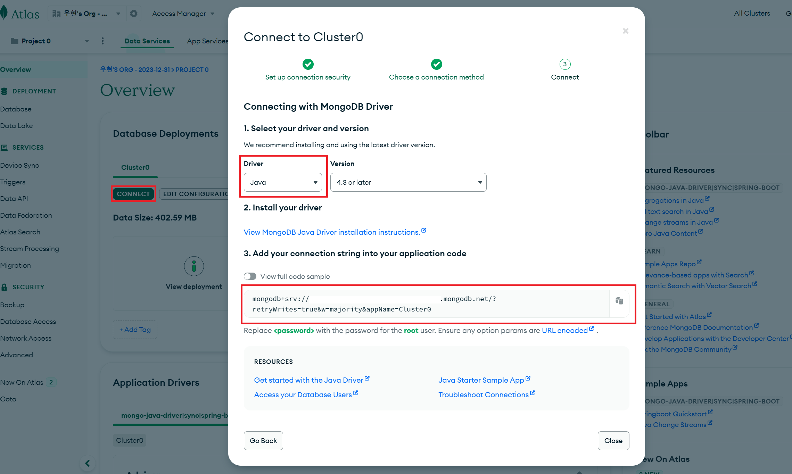

# MongoDB 사용하기

Spring project에서 몽고 DB 사용법을 알아보겠습니다.  
**MongoDB Atlas를 사용하여 연동**

선행 준비사항
> 1. MongoDB 회원가입
>> https://www.mongodb.com/
> 2. MongoDB Atlas로 이동 및 클러스터 생성
> 3. 내가 사용하는 IP 주소에 대하여 접속 허용
> 4. 몽고DB 클러스터, DB 생성, Collection 생성

1. MongoDB Connection Url 확인
  

2. MongoDB 의존성 추가
> implementation 'org.springframework.boot:spring-boot-starter-data-mongodb'  

3. `yaml` 파일에 `MongoDB Atlas`의 연결 url 추가
```
spring.data.mongodb.uri=mongodb+srv://{{username}}:{{password}}@{{cluser}}.mongodb.net/{{database}}?retryWrites=true&w=majority
```

4. MongoDB 연결 단위 테스트
```java
import com.mongodb.BasicDBObjectBuilder;
import com.mongodb.DBObject;
import org.junit.jupiter.api.DisplayName;
import org.junit.jupiter.api.Test;
import org.junit.jupiter.api.extension.ExtendWith;
import org.springframework.beans.factory.annotation.Autowired;
import org.springframework.boot.test.autoconfigure.data.mongo.DataMongoTest;
import org.springframework.data.mongodb.core.MongoTemplate;
import org.springframework.test.context.junit.jupiter.SpringExtension;

import static org.assertj.core.api.Assertions.assertThat;

@DataMongoTest
@ExtendWith(SpringExtension.class)
public class CourseTrackerSpringBootApplicationTests {
    @Autowired
    private MongoTemplate mongoTemplate;
    @DisplayName("mongodb 연결 테스트")
    @Test
    public void givenObjectAvailableWhenSaveToCollectionThenExpectValue() {
        // given
        DBObject object = BasicDBObjectBuilder.start()
                .add("duckbill413", "Spring boot With MongoDB")
                .get();

        // when
        mongoTemplate.save(object, "learner");

        // then
        assertThat(mongoTemplate.findAll(DBObject.class, "learner"))
                .extracting("duckbill413")
                .containsOnly("Spring boot With MongoDB");
    }
}

```