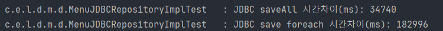

# JDBC Template
> 프로젝트 내 참조 클래스  
> `MenuJdbcRepository`

## 유용한 JDBC 활용
- `RowMapper` : RowMapper 인터페이스는 데이터베이스의 결과 행을 객체로 매핑하는 방법을 정의
  ```java
  RowMapper<Menu> MENU_ROW_MAPPER = (rs, rowNum) -> Menu.builder()
              .id(rs.getLong("id"))
              .name(rs.getString("name"))
              .price(rs.getLong("price"))
              .stock(rs.getLong("stock"))
              .build();
  ```

- `NamedParameterJdbcTemplate`
  JDBC를 사용하여 SQL 쿼리를 실행하는 데 사용되며, 이름 기반의 파라미터 바인딩을 지원  
  `?` 대신에 `:name`과 같은 형태로 파라미터를 바인딩할 수 있으며, 이를 통해 코드의 가독성을 높이고 오류 가능성을 줄일 수 있다.
    - `queryForObject()`: 단일 행을 반환하는 SQL 쿼리를 실행하는데 사용
      > namedParameterJdbcTemplate.queryForObject(sql, params, MENU_ROW_MAPPER);
    - `query()`: 복수 행을 반환하는 쿼리를 실행하는데 사용
      > namedParameterJdbcTemplate.query(sql, MENU_ROW_MAPPER)
    - `batchUpdate()`: insert 및 update를 batch 쿼리를 이용해서 동작 성능 향상을 노릴 수 있음
      > namedParameterJdbcTemplate.batchUpdate(sql, params)

      > non-batch  
      > `insert into Person (name, age) value ("김싸피", 21);`  
      > `insert into Person (name, age) value ("정싸피", 22);`  
      > `insert into Person (name, age) value ("홍싸피", 23);`
      > ---
      > batch  
      > `insert into Person (name, age) values ("김싸피", 21), ("정싸피", 22), ("홍싸피", 23);`
- `SqlParamterSource`: SQL 쿼리 파라미터 값을 제공하는 방법을 정의 이름 기반의 파라미터를 사용하는 경우 `NamedParameterJdbcTemplate`와 같이 사용
  ```java
  SqlParameterSource[] params = menus
    .stream().map(BeanPropertySqlParameterSource::new)
    .toArray(SqlParameterSource[]::new);
  ```
- `BeanPropertySqlParameterSource`: `SqlParameterSource` 인터페이스를 구현한 것으로, Java Bean의 프로퍼티 값을 SQL 쿼리의 파라미터로 사용하는데 사용, `Bean`의 `getter`메소드를 통해 파라미터 값을 얻는다. 단, `getter`을 자주 사용하게 되므로 약간의 오버헤드가 발생할 수 있다.
- `SimpleJdbcInsert`: 데이터에 새로운 행을 삽입하는데 사용되는 JDBC 코드를 단순화 하기 위해 사용. 테이블 이름과 데이터 만으로 간단하게 `INSERT` 쿼리를 생성하고 실행
  ```java
  SimpleJdbcInsert jdbcInsert = new SimpleJdbcInsert(namedParameterJdbcTemplate.getJdbcTemplate())
    .withTableName("Menu")
    .usingGeneratedKeyColumns("id"); // @GeneratedValue(strategy = GenerationType.IDENTITY) Key
  ```
## INSERT와 Bulk INSERT
### INSERT
저장 한번에 하나의 쿼리가 발생
```java
private Menu insert(Menu menu) {
    SimpleJdbcInsert jdbcInsert = new SimpleJdbcInsert(namedParameterJdbcTemplate.getJdbcTemplate())
            .withTableName("Menu")
            .usingGeneratedKeyColumns("id"); // @GeneratedValue(strategy = GenerationType.IDENTITY) Key

    SqlParameterSource params = new BeanPropertySqlParameterSource(menu);
    var id = jdbcInsert.executeAndReturnKey(params).longValue();

    return Menu.builder()
            .id(id)
            .name(menu.getName())
            .price(menu.getPrice())
            .stock(menu.getStock())
            .build();
}
```

### Bulk INSERT
여러 건의 저장에도 쿼리는 한번만 발생
```java
@Override
public int saveAll(List<Menu> menus) {
    // JDBC의 bulk insert를 이용해 보겠다.

    var sql = """
            INSERT INTO Menu (name, price, stock)
            VALUES (:name, :price, :stock)
            """;

    SqlParameterSource[] params = menus
            .stream().map(BeanPropertySqlParameterSource::new)
            .toArray(SqlParameterSource[]::new);

    var result = namedParameterJdbcTemplate.batchUpdate(sql, params);
    return Arrays.stream(result).sum();
}
```

>시간 차이 분석 테스트 결과  

