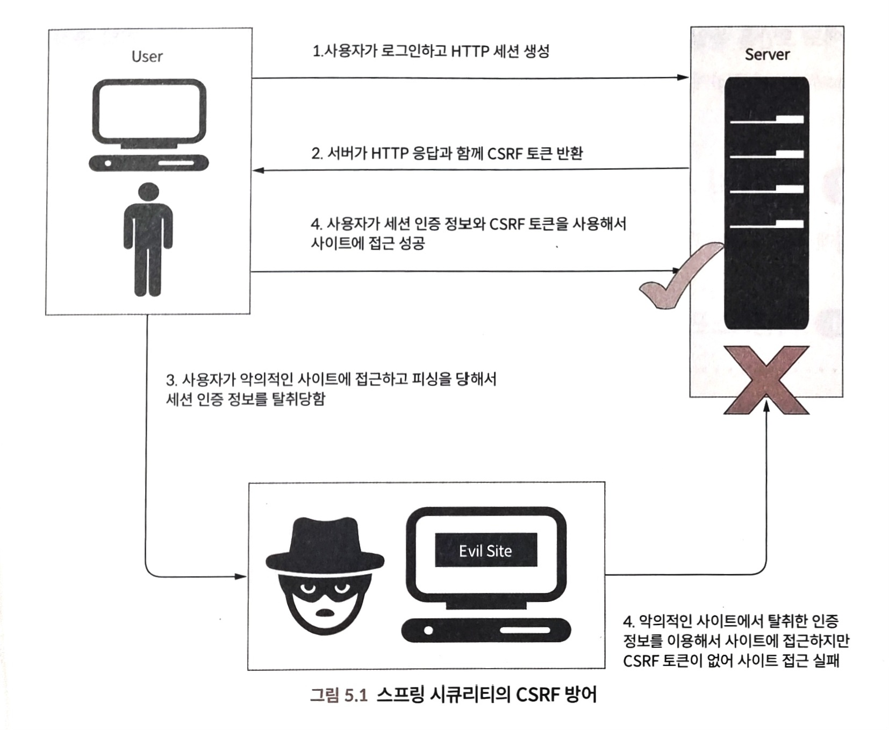
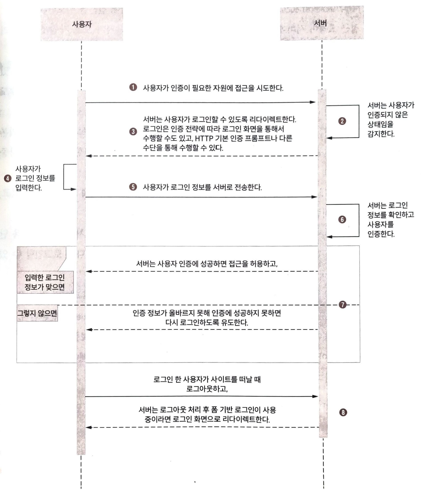
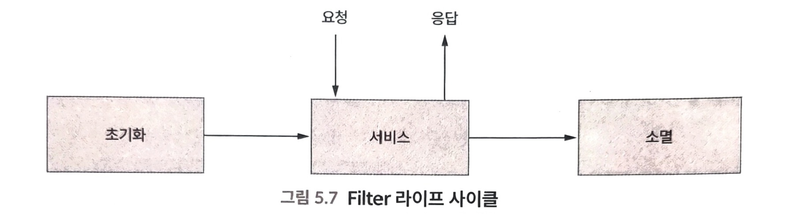
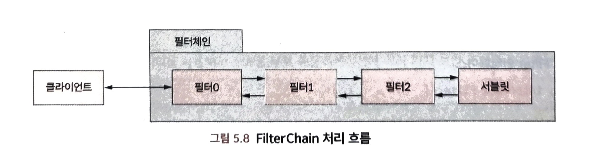
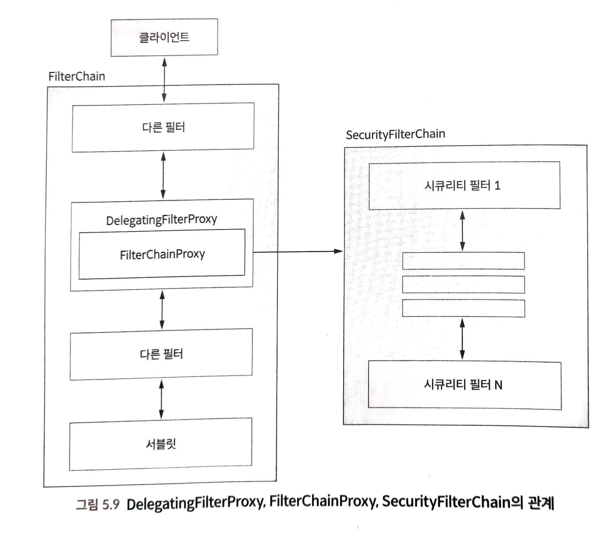

# 스프링 시큐리티
스프링 시큐리티 모듈은 스프링 애플리케이션에 초점을 맞춘 모듈이다.

> 스프링 시큐리티 기본 보안 기능
> - 애플리케이션 사용자 인증
> - 별도의 로그인 페이지가 없을 때 사용할 수 있는 기본적인 로그인 페이지
> - 폼 기반 로그인에 사용할 수 있는 기본 계정
> - 패스워드 암호화에 사용할 수 있는 여러 가지 인코더
> - 사용자 인증 성공 후 세션 ID를 교체해서 세션 고정 공격(session fixation attack) 방지
> - HTTP 응답 코드에 랜덤 문자열 토큰을 포함해서 사이트 간 요청 위조(cross-site request forgery. CSRF) 공격 방지
> - 자주 발생하는 보안 공격을 방어할 수 있는 여러 가지 HTTP 응답 헤더 제공
> > Cache-Control: no-cache, no-store, max-age=0, must-revalidate  
> > Pragma: no-cache  
> > Expires: 0  
> > X-Content-Type-Options: nosniff  
> > Strict-Transport-Security: max-age=31536000 ; includeSubDomains  
> > X-Frame-Options: DENY
> > X-XSS-Protection: 1; mode=block

> 스프링 시큐리티의 CSRF 방어
> 
> - `Cache-Control`: 브라우저 캐시를 완전하게 비활성화
> - `X-Content-Type-Options`: 브라우저의 콘텐츠 타입 추측을 비활성화하고 `Content-Type` 헤더로 지정된 콘텐츠 타입으로만 사용하도록 강제
> - `Strict-Transport-Security`: 응답 헤더에 포함되면 이후 해당 도메인에 대해서는 브라우저가 자동으로 HTTPS를 통해 연결하도록 강제하는 `HSTS`(`HTTP Strict Transport Security`) 활성화 (https://docs.spring.io/spring-security/reference/features/exploits/headers.html#headers-hsts)
>   - HTTP로 연결을 할 경우 중간자 공격에 취약하므로 HTTPS 연결을 강제
> - `X-Frame-Options`: 값을 `DENY`로 설정하면 웹 페이지 콘텐트가 `frame`, `iframe`, `embed`에서 표시되지 않도록 강제해서 클릭재킹(`clickjacking`) 공격 방지
> - `X-XSS-Protection`: 값을 1; `mode=blck`으로 설정하면 브라우저의 `XSS`(`cross site scripting`) 필터링을 활성화하고 `XSS` 공격이 감지되면 해당 웹 페이지를 로딩하지 않도록 강제

> 스프링 시큐리티 의존성 추가
> ```
> implementation 'org.springframework.boot:spring-boot-starter-security'
> ```
> 스프링 시큐리티 의존성을 추가하면 기본적인 로그인 페이지와 `/login`, `/logout` 엔드포인트를 기본으로 제공해준다.

### 웹 애플리케이션 인증 과정

### 필터, 필터체인과 스프링 시큐리티
- 클라이언트는 `HTTP`, `HTTPS` 프로토콜을 사용하여 서버의 자원에 접근하고 요청은 서버의 서블릿(`Servlet`)에서 처리
- 서블릿은 HTTP 요청을 받아 처리 후 HTTP 응답을 클라이언트에 반환
- 스프링에서는 `DispatcherServlet`이 역할을 담당
- 필터는 서블릿의 앞 단에 위치하여 **요청-응답**을 가로채서 변경

> Filter Interface
> ```java
> public interface Filter {
>   public default void init(FilterConfig filterConfig) throws ServletException {}
>   public void doFilter(ServletRequest request, ServletResponse response, FilterChain chain) throws IOException, ServletException;
>   public default void destroy() {}
> }
> ```
> `Filter` 인터페이스는 3개의 메서드가 있으므로 `Filter` 구현체는 3개의 메서드를 구현해야 한다.  
> 실질적인 로직 처리는 `doFilter` 메서드에 구현
> 
> - `init()`: 서블릿 컨테이너가 필터를 등록하는 초기화 과정에서 호출
> - `doFilter()`: 필터의 실질적인 작업을 수행하는 메서드로서 요청, 응답 `FilterChain` 객체에 접근할 수 있다. `FilterChain`은 필터의 작업이 완료된 후 체인에 있는 다음 필터를 호출
> - `destory()`: 서블릿 컨테이너가 필터를 제거할 때 호출
> 
> 
> `FilterChain`은 요청이 체인에 있는 여러 필터를 연쇄적으로 거쳐서 흘러가게 만드는 역할을 수행
> ```java
> public interface FilterChain {
>   public void doFilter(ServletRequest request, ServletResponse response) throws IOException, ServeletException;
> }
> ```
> 스프링 시큐리티는 다양한 필터를 많이 사용한다. 예를 들어 아이디/패스워드 기반 인증 요청은 `UsernamePasswordAuthenticationFilter`를 통과하면서 인증이 수행된다.  
> HTTP 기본 인증도 스프링 시큐리티의 `BasicAuthenticationFilter`를 통해 수행한다.

### 스프링 시큐리티 아키텍처
`DelegatingFilterProxy`, `FilterChainProxy`, `SecurityFilterChain`  
- `DelegatingFilterProxy`: 서블릿 필터와 스프링 사이의 간극을 채우는 데 사용된다. `DelegatingFilterProxy`는 서블릿 필터이며 서블릿 컨테이너에 등록, 관리 된다.  `DeletegatingFilterProxy`안에서 스프링 빈은 `delegate`로 설정되며, 런타임에 가로챈 요청을 `delegate`로 설정된 스프링 빈에 위임해서 처리한다.
- `FilterChainProxy`: `FilterChainProxy`는 하나 이상의 `SecurityFilterChain`을 가진다. `DelegatingFilterProxy`가 필터로서 가로챈 요청을 `FilterChainProxy`에 위임하면 `FilterChainProxy`는 자신이 가지고 있는 `SecurityFilterChain`에 요청을 흘려서 `SecurityFilterChain`의 필터를 통과 하도록 한다.


## `SecurityConfiguration` 클래스
